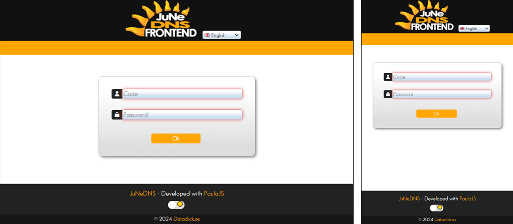
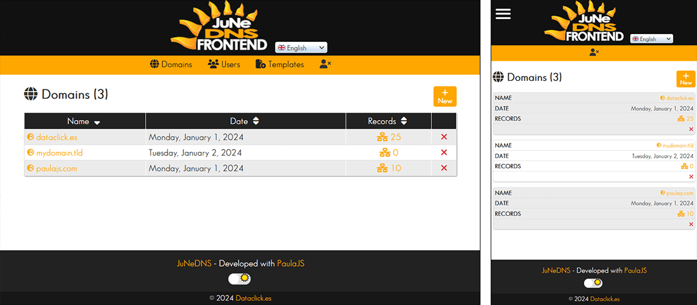
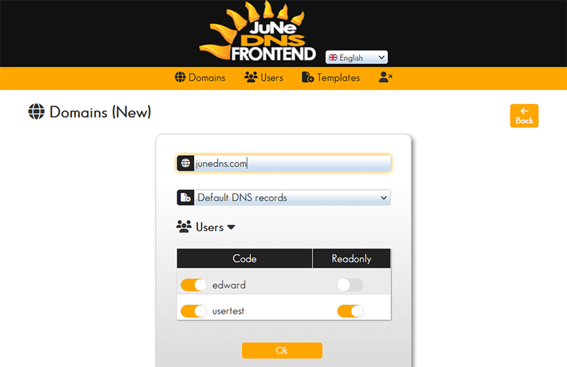
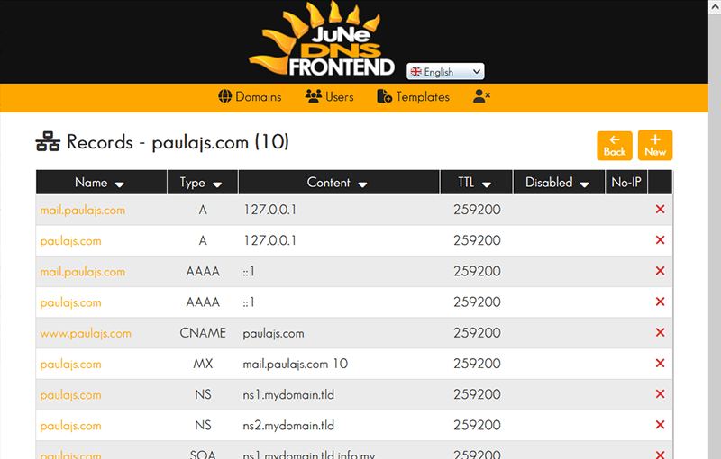
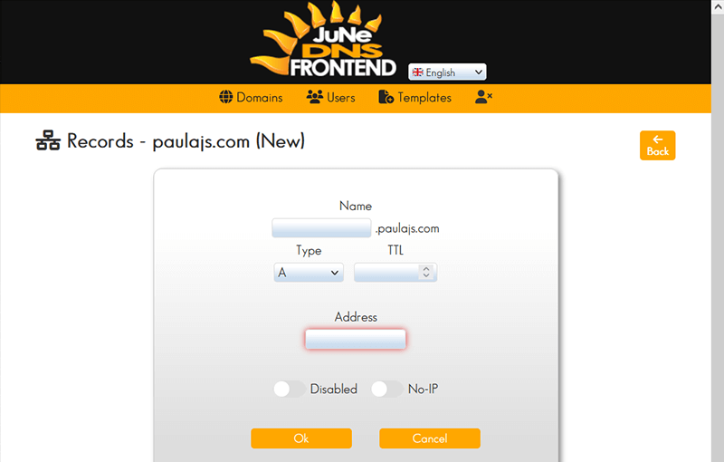

<p align="center">
  <a href="https://junedns.com"></a>
</p>
<h1 align="center">
  <a href="https://github.com/EduardoRuizM/junedns-frontend">EduardoRuizM/junedns-frontend</a>
</h1>
<p align="center">
  Dataclick Olimpo <a href="https://junedns.com">☀️JuNeDNS Frontend</a>
  Safe, Lightweight and Full DNS Server ideal for single or hosting servers
  https://www.junedns.com
</p>

# [☀️JuNeDNS Frontend](https://junedns.com "JuNeDNS Frontend")
## 🖥️ Frontend for [JuNeDNS Backend](https://github.com/EduardoRuizM/junedns-backend "JuNeDNS Backend")

JuNeDNS is a lightweight DNS server, backend and frontend created in Node.js with a fully functionality and easy installation and use. With templates to easily create domain zones.

This frontend is made with included [JuNe PaulaJS](https://github.com/EduardoRuizM/june-paulajs "JuNe PaulaJS") and [JuNe CSS](https://github.com/EduardoRuizM/june-css "JuNe CSS").

📱  Responsive design.
👥Permissions for admins or readonly.

# Author
[Eduardo Ruiz](https://github.com/EduardoRuizM) <<eruiz@dataclick.es>>

# [JuNe](https://just-needed.com "JuNe") / JUst NEeded Philosophy
1. **Source code using less code as possible**
  So you can understand code and find bugs easier.
2. **Few and optimized lines is better**
  Elegant design.
3. **Avoid external dependencies abuse/bloated, and possible third-party bugs**
  Less files size, better and faster to the interpreter.
4. **Clear and useful documentation with examples and without verbose**
  Get to the point.
5. **Avoid showing unsolicited popups, notifications or messages in frontend**
  For better User eXperience.
6. **Simple UI**, without many menus/options and with few clicks to get to sites.
7. Consequences of having a lot of code (and for simple things): Having to work and search through many files and folders with a lot of wasted time, successive errors due to missing unknown files, madness to move a code to another project, errors due to recursive dependencies difficult to locate, complexity or impossibility to migrate to new versions, unfeasibility to follow the trace with so much code, risk of new errors if the functionality is extended, problems not seen at the first sight, general slowness in the whole development due to excessive and unnecessary code.

# Installation
### 1. Install and configure [JuNeDNS Backend](https://github.com/EduardoRuizM/junedns-backend "JuNeDNS Backend")
Don´t forget to create an admin user.

### 2. Configuration JuNeDNS Frontend
**backend_url** in `main.js` (default *http://localhost:9053*)
(same as `backend_url` in JuNeDNS Backend´s `junedns.conf`)
```
export const data = {forceUpdate: false, uploadLargeMax: 10240, backend_url: 'http://localhost:9053'};
```

### 3. Run server with included [JuNe WebServer](https://github.com/EduardoRuizM/june-webserver "JuNe WebServer")
`npm run start`

## 🏳Languages
Help us to translate JuNeDNS in your language 📩 info@junedns.com

| Code | Short code | Language |
| :---: | --- |
| en-US | en | 🇬🇧 English |
| es-ES | es | 🇪🇸 Español |
| fr-FR | fr | 🇫🇷 Français |
| de-DE | de | 🇩🇪 Deutsch |
| it-IT | it | 🇮🇹 Italiano |
| pt-PT | pt | 🇵🇹 Português |
| zh-CN | ch | 🇨🇳 中文 |

------------
This guide has been made, not only as JuNeDNS Frontend information, but also as an example of how to develop with JuNe PaulaJS and JuNe Backserver.
So it can be useful as a basis for other types of developments.
------------

# Session control token
The perfect combination between [JuNe PaulaJS](https://paulajs.com "JuNe PaulaJS") and [JuNe BackServer](https://github.com/EduardoRuizM/june-backserver "JuNe BackServer")
You can use the session system of this project.
- When the user logs in; token, user and token expiration are saved in memory, expiration default is 900 seconds (15 minutes).
- If you set expiration to -1 then session never expires, so user can enter again without login at any time.
- The token is also stored in the browser´s localStorage.
- Status 401 is always used for token expiration or user revoked.
- If there is an expiration, after this time the session is automatically logout, returning to the login page.
- If user logout himself, the token is also removed from the localStorage.
- If user opens a new tab or window, token is fetched from localStorage and send a request to backend (GET /login) to get user, permissions and token expiration.
- On each request, user is checked to verify if exists or if permissions revoked, also token is updated with new expiration date,
  otherwise, if the session is not updated at each request, at the end of the expiration time, a logout will be triggered.
  If there is no longer access, the login page is redirected and the token is removed from localStorage.
  Thus, header **X-Access-User** is sent every time with the updated user information.
- WebSocket token is updated for automatic content update on each successfully request.

### this.main.funcs.send(url, method, data, pget)
Global function for sending requests to backend and update token (expiration).
- *url*: Backend URL.
- *method*: optional HTTP method (default GET).
- *data*: optional data to send, can be an object, or if it´s a string then get FormData from this form (string is the id) using fdata function (default nothing).
- *pget*: Optional GET parameters, the selected language code is always added (default nothing).

⏱ This function is asynchronous, but you may prefer to use a promise, in that case and if you want perform the actions previous to send data, you can use the *send* breakdown with:
- **this.main.funcs.sendIni(url, method, data, pget = {})** for the start of the call, returns object with url and options.
- **this.main.funcs.sendEnd(response)** for after the call and returns false if logout (so the calling function must end).

```
const p = this.main.funcs.sendIni(url, method, data, pget);
fetch(p.url, p.options).then(response => {
  const headers = this.main.funcs.sendEnd(response);
  if(response.ok)
    return response.json();
  else
    this.toastShow(`Error: ${response.statusText}`);
}).then(json => {
  // Process JSON here
}).catch(err => {
  this.idle(false);
  this.toastShow(`Error: ${err}`);
});
```

### this.main.funcs.timerSession()
Restart session timer for logout when expires.

### this.main.funcs.checkSession()
Gets token from localStorage if it exists and no previous values loaded, then sends a request to backend (GET /login) to get user, permissions and token expiration.
Restart timerSession for the new expiration.
Returns true/false if user exists.

### this.main.funcs.logout(force)
Closes user session and redirects to login page.
Removes token from localStorage if session expires or if user logs out himself.
If force is true don´t shows need login toast message.

### login.funcs.login()
Sends user login request to this.main.funcs.send and stores needed values if ok.

### login.funcs.onMount()
Checks session with this.main.funcs.checkSession and if true redirects from main page (login) to domains (default page) if logged in.

### (domains|records|users|templates).funcs.onMount()
Checks session with this.main.funcs.checkSession and if false redirects to main page (login).
This function must be in internal sections that require login: domains, records, users and templates.

[========]

So, actually the session system, which was being used before at the beginning of the Internet, was a bit more practical and needed less code,
also because HTML is no longer processed in the backend.

With sessions, the backend creates a cookie that it returns to the browser, and in the server database there is a session table with the unique information of each cookie per user.

With token system, information (such as the user´s login) is encrypted in the token, this is done because the token must be sent to the frontend,
so that the frontend then sends it back to the backend, and thus checks if it´s valid and can also contain more necessary information, this is done with the header **x-access-token**,
but in this way the frontend has no information about the connected user because this information is encrypted, which is only used as validation of the session,
and if a user data is changed, or permissions are changed, the frontend must know it, so another header **x-access-user** is used with the user information without encryption,
which is returned updated to the frontend in each request.

Thus, many backend/frontend systems that are made today, have the problem of user and token validation.
Although then finally the backend may return an error in the request, but you can see the following problems:

1) The token has no expiration, so if the user does not log out, he will always be able to connect.

2) If the token expires, but it is not updated, then after a while, and even if you are using the application, the session will be closed.

3) If the user is deleted, or permissions are changed, the frontend does not know it, and does not update the options that the user should see, nor can the session be closed,
   this can be a security breach by continuing to display sensitive information.

[========]

# 🗣 Speech recognition
Used only in menus, to show how this JuNe PaulaJS feature works, works only in Chromium browsers, if a microphone appears, then you can click and say some menu option to navigate there.

# ⚡ Automatic content update
With this feature, the content being displayed on the page, such as domains or records, is automatically updated if another user from another computer updates that content.
- When logging in, a WebSocket is created with `this.main.funcs.wsocket_create()` if there is an error, retry to connect every 2 seconds.
- A message is received to all logged users if another user makes a change, and is updated if it matches the displayed location page.
  Objects contains action, module and id (created, updated, deleted). Sample object: `{action: 'created', module: 'domains', id: 1}`
- If logout the socket is closed with `this.main.funcs.wsocket_remove()`
- WinSocket handlers are not in *this.main.data* and are in **this.main.dataws** to be outside the reactive variable system.
- Send data (object) with **this.main.funcs.wsocket_send({data: mydata})**
- Object sent to each client when changes: {m: MODULENAME, a: ACTION, id: id}
  **m** is the module name, example: domains, records, users or templates.
  **a** the action: new, edit or delete.
  **id** optional database table record id.

# Snapshots










# JuNeDNS Server & Backend & No-IP
https://github.com/EduardoRuizM/junedns-server
https://github.com/EduardoRuizM/junedns-backend
https://github.com/EduardoRuizM/junedns-noip

# Included to make this project
| Tech | Name |
| --- | --- |
| JavaScript Framework | [JuNe PaulaJS](https://paulajs.com "JuNe PaulaJS") Powerful JavaScript framework - [GitHub](https://github.com/EduardoRuizM/june-paulajs "GitHub") |
| CSS | [JuNe CSS](https://github.com/EduardoRuizM/june-css "JuNe CSS") |
| WebServer | [JuNe WebServer](https://github.com/EduardoRuizM/june-webserver "JuNe WebServer") |

# Trademarks©️
**Dataclick Olimpo JuNeDNS**
- [Dataclick.es](https://www.dataclick.es "Dataclick.es") is a software development company since 2016.
- [Olimpo](https://www.dataclick.es/en/technology-behind-olimpo.html "Olimpo") is a whole solution software to manage all domains services such as hosting services and to create Webs in a server.
- [JuNe](https://just-needed.com "JuNe") / JUst NEeded Philosophy, available software and development solutions.
- [JuNeDNS](https://junedns.com "JuNeDNS") is a part of Dataclick Olimpo domains management for DNS service, released to Internet community.
- Feel free to use JuNeDNS acording MIT license respecting the brand and image logotype that you can use.
